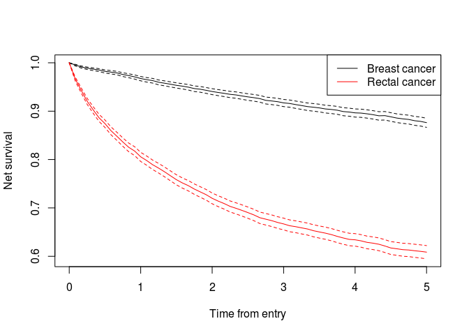
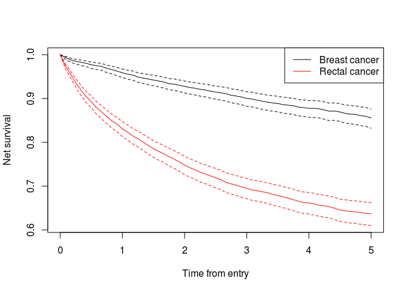

Changes in 0.3
==============

Adjusting
---------

Direct adjusting (computing weighted averages of estimates) has been generalized. Functions such as `survtab` and `survmean` allow for using `adjust()` mini function within formulas, or a separate `adjust` argument. Weights are passed separately. See the examples in the next chapter. See also `?direct_adjusting`.

Estimating functions of survival time
-------------------------------------

The `survtab` function computes observed, net/relative and cause-specific survivals as well as cumulative incidence functions for `Lexis` data. Any of the supported survival time functions can be easily adjusted by any number of categorical variables if needed.

One can also use `survtab_ag` for aggregated data. This means the data does not have to be on the subject-level to compute survival time function estimates.

``` r
## prep data
data(sibr)
sire$cancer <- "rectal"
sibr$cancer <- "breast"
sr <- rbind(sire, sibr)

sr$cancer <- factor(sr$cancer)
sr <- sr[sr$dg_date < sr$ex_date, ]

sr$status <- factor(sr$status, levels = 0:2, 
                    labels = c("alive", "canD", "othD"))

## create Lexis object
library(Epi)
#> 
#> Attaching package: 'Epi'
#> The following object is masked from 'package:base':
#> 
#>     merge.data.frame
x <- Lexis(entry = list(FUT = 0, AGE = dg_age, CAL = get.yrs(dg_date)), 
           exit = list(CAL = get.yrs(ex_date)), 
           data = sr,
           exit.status = status)
#> NOTE: entry.status has been set to "alive" for all.

## population hazards file - see ?pophaz for general instructions
data(popmort)
pm <- data.frame(popmort)
names(pm) <- c("sex", "CAL", "AGE", "haz")

## simple usage - uses lex.Xst as status variable
st <- survtab(FUT ~ cancer, data = x,
              breaks = list(FUT = seq(0, 5, 1/12)),
              surv.type = "surv.rel", pophaz = pm)

## more explicit usage
library(survival)
st <- survtab(Surv(FUT, event = lex.Xst) ~ cancer, data = x,
              breaks = list(FUT = seq(0, 5, 1/12)),
              surv.type = "surv.rel", pophaz = pm)

plot(st, col = 1:2)
#> y was NULL; chose r.e2 automatically
legend("topright", col = 1:2, lty = 1, legend = c("Breast cancer", "Rectal cancer"))
```

<!-- -->

``` r

## adjusting
x$agegr <- cut(x$dg_age, c(0,55,65,75,Inf))
w <- as.numeric(table(x$agegr))
st <- survtab(Surv(FUT, event = lex.Xst) ~ cancer + adjust(agegr), 
              data = x,
              breaks = list(FUT = seq(0, 5, 1/12)),
              surv.type = "surv.rel", 
              pophaz = pm, weights = w)

plot(st, col = 1:2)
#> y was NULL; chose r.e2.as automatically
legend("topright", col = 1:2, lty = 1, legend = c("Breast cancer", "Rectal cancer"))
```

<!-- -->

Rates
-----

The new `rate` function enables easy calculation of e.g. standardized incidence rates:

``` r
## dummy data

a <- merge(0:1, 1:18)
names(a) <- c("sex", "agegroup")
set.seed(1)
a$obs <- rbinom(nrow(a), 100, 0.5)
set.seed(1)
a$pyrs <- rbinom(nrow(a), 1e4, 0.75)

## so called "world" standard rates (weighted to hypothetical world pop in 2000)
r <- rate(data = a, obs = obs, pyrs = pyrs, print = sex, 
          adjust = agegroup, weights = 'world_2000_18of5')
```

|  sex|  obs|    pyrs|   rate.adj|  SE.rate.adj|  rate.adj.lo|  rate.adj.hi|       rate|   SE.rate|    rate.lo|    rate.hi|
|----:|----:|-------:|----------:|------------:|------------:|------------:|----------:|---------:|----------:|----------:|
|    0|  933|  134986|  0.0069947|     1.036992|    0.0065140|    0.0075108|  0.0069118|  1.001072|  0.0068973|  0.0069264|
|    1|  875|  134849|  0.0064453|     1.038402|    0.0059865|    0.0069394|  0.0064887|  1.001143|  0.0064742|  0.0065033|
